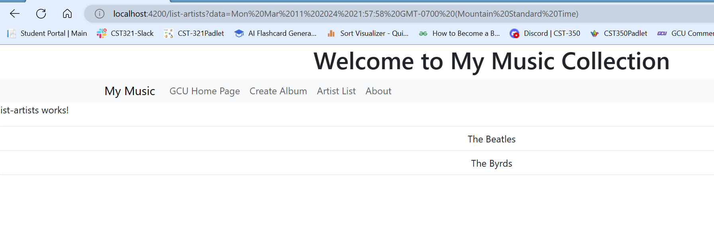
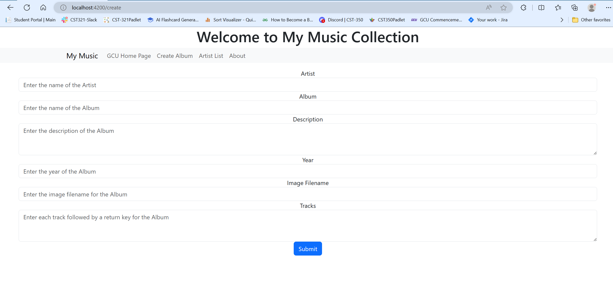

# CST-391 Activity 4
By Rebecca Johnson

### Screenshots
- Main Application screen

- Artist List screen,

- Album List screen

- Album Display (with tracks) screen

- Add/Create Album

#### Research Questions

**Research how an Angular application maintains a logged in state. How does it communicate this state to the server?**

---
    Using Angular libraries such as NgRx amoung other things to manage the state in the application. There is some built in features to keep track of user states and authenticity of said user like cookies and using HTTP request and responsed to manage this authorization. This is all the middleware that communicates the state to the server to maintains a logged in state.
