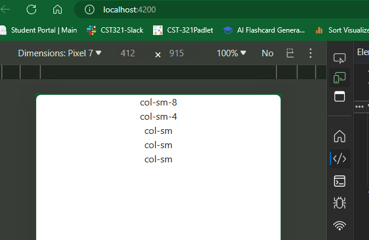
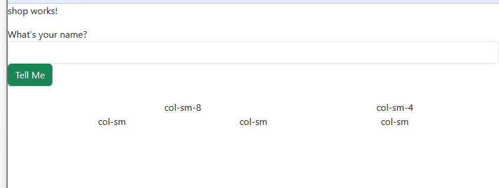
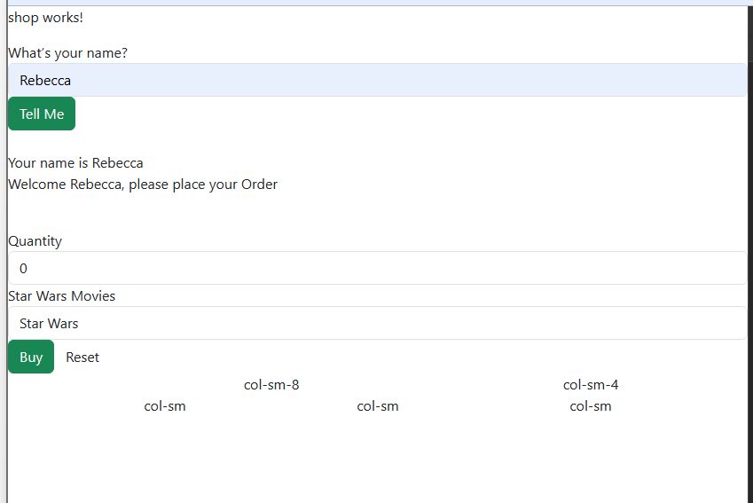
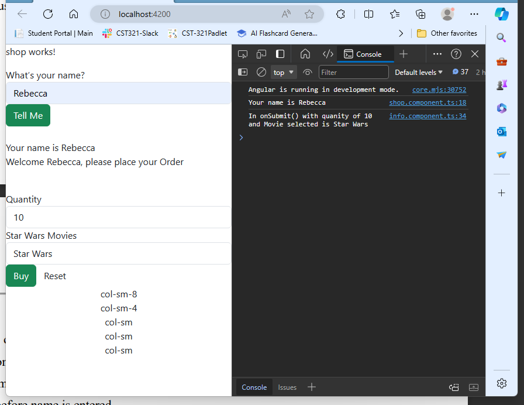
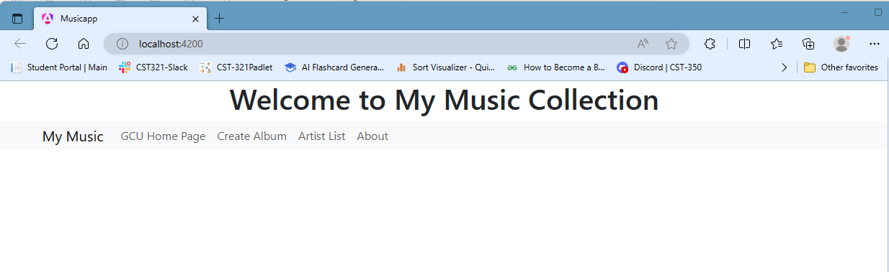
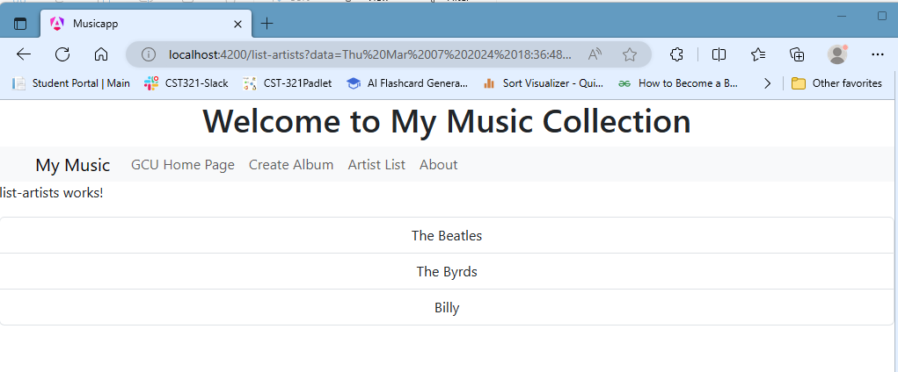
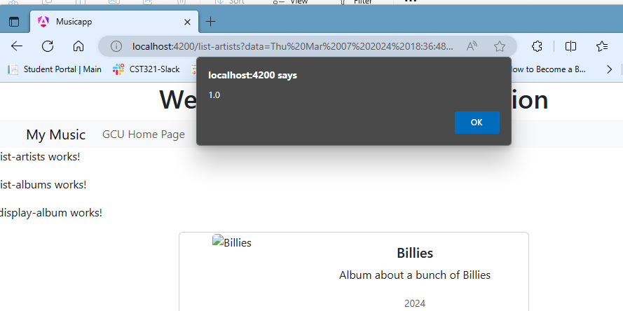

# CST-391 Activity 3 
By Rebecca Johnson

## Part 1 - Basic Angular Components, Events, Routes, & Data Binding

### Screenshots

- Responsive Grid




- Before name is entered



- After the name is entered.



- Dev tools with quantity and product



#### Research Questions

**1. Describe @Input decorator used in info.component.ts**

     The @Input decorator helps the application identify the data and move it to the view. This passes the provide input to the view to customize the view to include information related to that data. 

**2. Describe [value] used in info.component.html**

     [value] is used to keep track of string values that are in the given object. 

**3. Describe [(ngModel)] also used in info.component.html**

     [(ngModel)] is like [value] but is used to keep track of object values that are in the given object. 

## Part 2 - Creating a Music Application – The Front End
### Screenshots
- The initial application page



- GCU homepage


- Create Album page


- Artist List page showing your added album/artist



- About Box




### Code for music-service.service.ts
``` js
import { Injectable } from '@angular/core';
import exampledata from '../../data/sample-music-data.json';
import { Artist } from './../models/artists.model';
import { Album } from '../models/albums.model';

@Injectable({ providedIn: 'root' })
export class MusicServiceService {

  albums: Album[] = exampledata;

  //Retreives list of artists
  public getArtists(): Artist[] {
    let artists: Artist[] = [];
    let artistSet = new Set<string>();

    //loops through albums list and adds the artist object and 
    //saves it to the list
    this.albums.forEach(a => artistSet.add(a.artist));

    //loops through albums list and adds the artist name and saves it to 
    //the artistSet at the end
    artistSet.forEach(a => artists.push({artist: a}))
    //returns the list
    return artists;
  }

  public getAlbums(): Album[] {
    // Return the list of Albums
    return this.albums;
  }

  public getAlbumsOfArtist(artistName: String): Album[] {

    let albums: Album[] = [];

    //finds the matching albums of the provided artist
    this.albums.forEach(album => {
      if (album.artist == artistName) {
        //pushes it on the end of the array
        albums.push(album);
      }
    });

    //returns filtered albums
    return albums;

  }

  public createAlbum(album: Album): number {
    // Add a new Album to the list of Albums
    this.albums.push(album);
    return 1;
  }

  public updateAlbum(album: Album): number {
    // Search for the Album in the list of Albums and replace it in the list
    //finds the album with matching Id's 
    for (let i = 0; i < this.albums.length; ++i) {
      if (this.albums[i].albumId == album.albumId) {
        //updates the album where the id's are equal to the given one
        //and updating the album in the array
        this.albums.splice(i, 1, album); 
        return 0; //succeeded
      }
    }
    return -1; //failed
  }

  public deleteAlbum(id: number): number {
    // Search for the Album in the list of Albums and delete from the list
    for (let i = 0; i < this.albums.length; ++i) {
      if (this.albums[i].albumId == id) {
        //Deletes the album where the id's are equal to the given one
        //and removing it
        this.albums.splice(i, 1);
        return 0; //succeeded
      }
    }
    return -1; // failed
  }
}

```